# terraform-gcp-secret-manager

Production-ready Terraform module for Google Cloud Secret Manager. Manages secrets, secret versions, replication strategies, customer-managed encryption (CMEK), rotation policies, Pub/Sub notifications, and IAM bindings.

## Architecture

```mermaid
flowchart TD
    A[Terraform Module] --> B[Secrets]
    A --> C[Secret Versions]
    A --> D[IAM Bindings]

    B --> B1[Auto Replication]
    B --> B2[User-Managed Replication]
    B --> B3[CMEK Encryption]
    B --> B4[Rotation Policy]
    B --> B5[Pub/Sub Notifications]
    B --> B6[TTL / Expiration]
    B --> B7[Version Aliases]
    B2 --> B2a[Region Replicas]
    C --> C1[Secret Data]
    C --> C2[Enable / Disable]
    C --> C3[Base64 Decode]
    D --> D1[Secret Accessor]
    D --> D2[Version Adder]
    D --> D3[Admin]
    D --> D4[Conditional Access]

    style A fill:#4285F4,stroke:#1A73E8,color:#fff
    style B fill:#34A853,stroke:#1E8E3E,color:#fff
    style C fill:#EA4335,stroke:#D93025,color:#fff
    style D fill:#FBBC04,stroke:#F9AB00,color:#333
    style B1 fill:#81C784,stroke:#66BB6A,color:#333
    style B2 fill:#81C784,stroke:#66BB6A,color:#333
    style B3 fill:#A5D6A7,stroke:#81C784,color:#333
    style B4 fill:#A5D6A7,stroke:#81C784,color:#333
    style B5 fill:#A5D6A7,stroke:#81C784,color:#333
    style B6 fill:#A5D6A7,stroke:#81C784,color:#333
    style B7 fill:#A5D6A7,stroke:#81C784,color:#333
    style B2a fill:#C8E6C9,stroke:#A5D6A7,color:#333
    style C1 fill:#EF9A9A,stroke:#EF5350,color:#333
    style C2 fill:#EF9A9A,stroke:#EF5350,color:#333
    style C3 fill:#EF9A9A,stroke:#EF5350,color:#333
    style D1 fill:#FFF176,stroke:#FDD835,color:#333
    style D2 fill:#FFF176,stroke:#FDD835,color:#333
    style D3 fill:#FFF176,stroke:#FDD835,color:#333
    style D4 fill:#FFF176,stroke:#FDD835,color:#333
```



## Usage

```hcl
module "secrets" {
  source = "path/to/terraform-gcp-secret-manager"

  project_id = "my-gcp-project"

  secrets = {
    "api-key" = {
      replication = {
        auto = {}
      }
    }
  }

  secret_versions = {
    "api-key-v1" = {
      secret_id   = "projects/my-gcp-project/secrets/api-key"
      secret_data = "my-api-key-value"
    }
  }
}
```

## Features

- Secret creation with labels, annotations, and version aliases
- Automatic replication with optional CMEK encryption
- User-managed replication with per-region CMEK keys
- Secret version management with enable/disable support
- Base64-encoded secret data support
- Rotation policies with configurable period and next rotation time
- Pub/Sub topic notifications for secret events
- TTL-based and timestamp-based secret expiration
- IAM bindings with conditional access support
- Comprehensive input validation

## Requirements

| Name | Version |
|------|---------|
| terraform | >= 1.3.0 |
| google | >= 5.0 |
| google-beta | >= 5.0 |

## Inputs

| Name | Description | Type | Required |
|------|-------------|------|----------|
| project_id | GCP project ID | `string` | yes |
| labels | Common labels for all secrets | `map(string)` | no |
| secrets | Map of secrets to create | `map(object)` | no |
| secret_versions | Map of secret versions to create | `map(object)` | no |
| secret_iam_bindings | IAM member bindings for secrets | `map(object)` | no |

## Outputs

| Name | Description |
|------|-------------|
| secret_ids | Map of secret IDs to resource IDs |
| secret_names | Map of secret IDs to resource names |
| secret_version_ids | Map of version logical names to resource IDs |
| secret_version_names | Map of version logical names to resource names |
| secret_version_numbers | Map of version logical names to version numbers |
| project_id | The GCP project ID |

## Examples

- [Basic](examples/basic/) - Simple secret with auto replication and IAM binding
- [Advanced](examples/advanced/) - CMEK encryption, rotation, Pub/Sub notifications
- [Complete](examples/complete/) - All features including TTL, expiration, base64, conditional IAM

## License

MIT License - see [LICENSE](LICENSE) for details.
